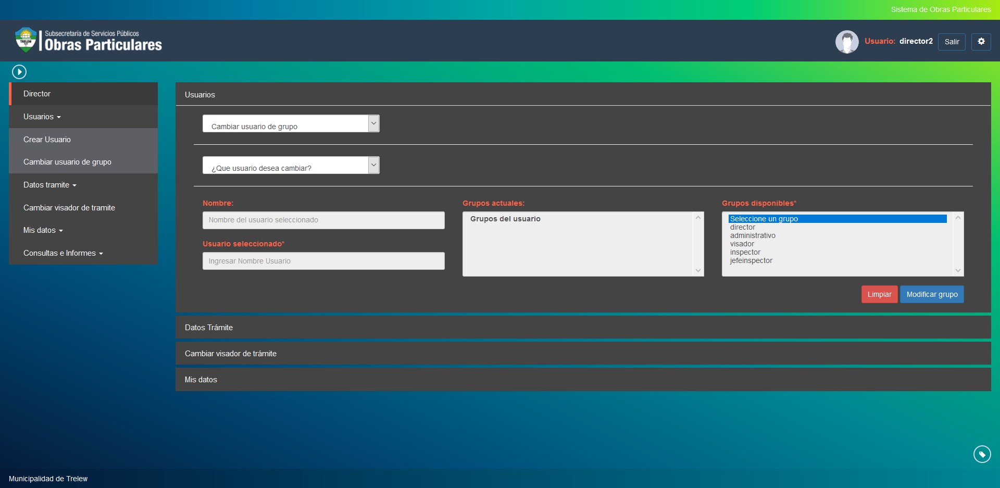

Cambiar usuario de grupo
========================

Esta opcion permite reasignar grupos a usuarios dentro del sistema. Las opciones a visualizar son las siguientes:

- **Usuarios actuales**: Indica una tabla de los usuarios dentro del sistema. al hacer click en algun usuario se muestran los grupos a los que pertenece
- **Grupos actuales**: Indica los grupos a los que pertenece el usuario seleccionado.
- **Grupos disponibles**: Indica los grupos que son posibles asignar al usuario seleccionado.

Puede confirmar el cambio de grupo haciendo click en el boton Modificar grupo o volver a cargar los campos haciendo click en el boton Limpiar.

