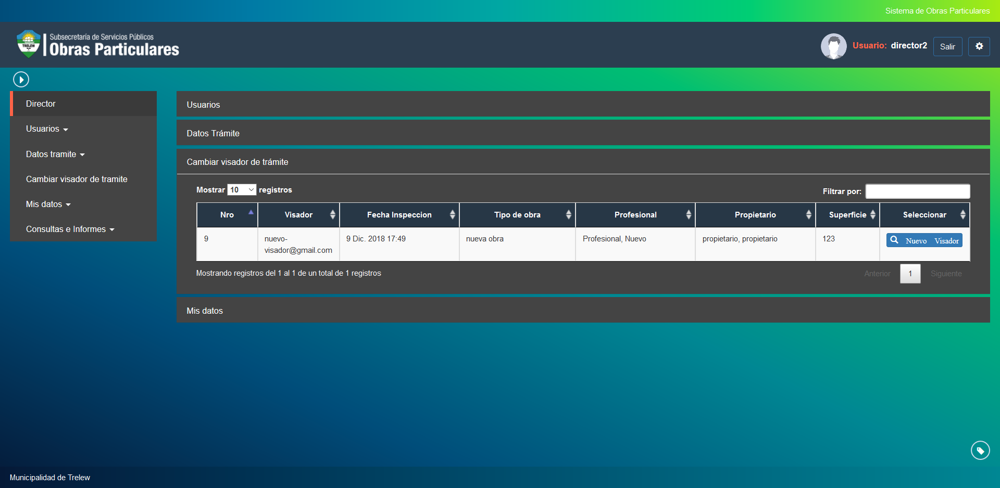

Cambiar visador de tramite
==========================

Esta opcion permite cambiar a un visador de un tramite en el cual este agendado. Las opciones que se visualizan son las siguientes:

- **Nro**: Indica el numero del tramite.
- **Visador**:  Indica el visador actual registrado en el tramite.
- **Fecha de inspeccion**: Indica la fecha de inspeccion del tramite.
- **Tipo de obra**: Indica el tipo de obra del tramite.
- **Profesional**: Indica el profesional asociado al tramite.
- **Propietario**: Indica el propietario del tramite.
- **Superficie**: Indica la superficie en metros de la obra.

Para realizar el cambio del visador actual asociado al tramite debera hacer click en la opcion Nuevo Visador.

.. image:: ../_static/director.5_b.png

En esta pantalla debera completar el formulario de cambio de visador indicando los siguientes campos:

- **Seleccionar Visador**: Indica una lista de los visadores actualmente registrados en el sistema para poder elegir.
- **Usuario**: (Campo de solo lectura) Indica el nombre de usuario del visador seleccionado.
- **Nombre**: (Campo de solo lectura) Indica el nombre del visador seleccionado.
- **Apellido**: (Campo de solo lectura) Indica el apellido del visador seleccionado.

Una vez ingresado el visador deseado debera hacer click en la opcion Cambiar Visador para registrar el cambio. En caso de querer reestablecer los campos del formulario puede hacer click en la opcion Limpiar
