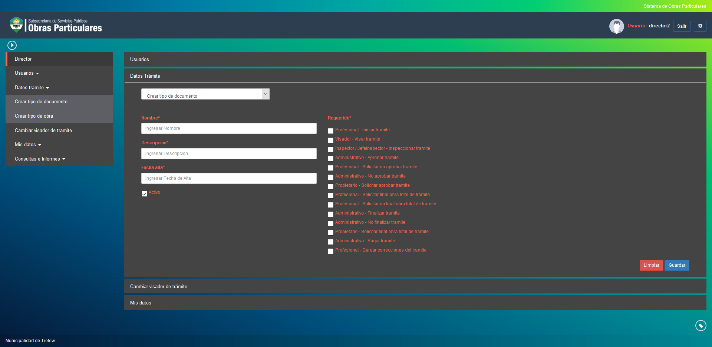

Crear tipo de documento
=======================

Esta opcion permite crear tipos de documento en del sistema. Los datos para la creacion de un nuevo tipo de documento son los siguientes:

- **Nombre**: Es el nombre del tipo de documento a dar de alta.
- **Descripcion**: Es la descripcion del tipo de documento a dar de alta.
- **Fecha alta**: Fecha en que se da de alta el tipo de documento.
- **Activo**: Indica si el tipo de documento esta activo en el sistema.
- **Requerido**: Indica para que momento o estado del tramite es requerido ese tipo de documento.

Puede confirmar el alta del tipo de documento haciendo click en el boton Guardar o volver a cargar los campos haciendo click en el boton Limpiar.

