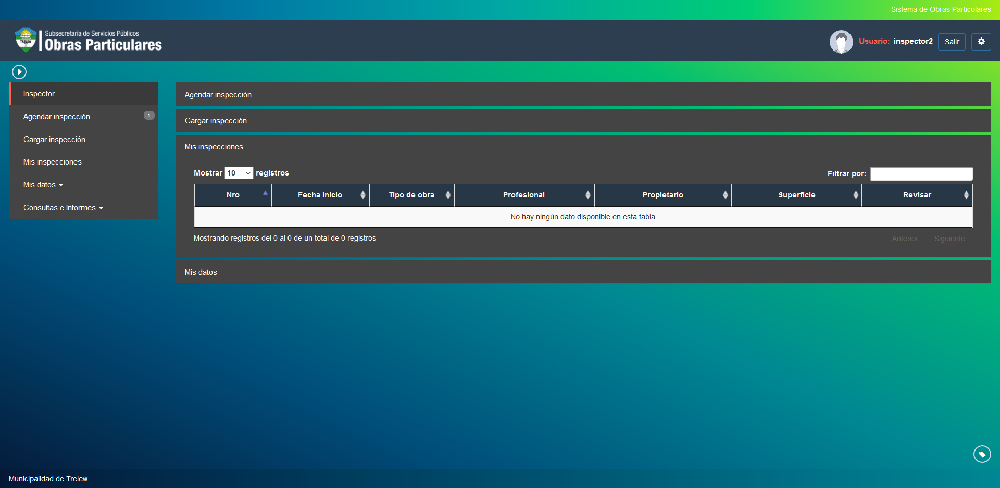

Mis inspecciones
================

Esta opcion permite realizar un seguimiento de sus inspecciones por tramite. Las opciones a visualizar son las siguientes:

- **Nro**: Indica el numero del tramite a agendar.
- **Fecha Inicio**: Indica la fecha de inicio del tramite a agendar.
- **Tipo de Obra**: Indica el tipo de obra del tramite.
- **Profesional**: Indica el profesional a cargo del tramite.
- **Propietario**: Indica el propietario del tramite.
- **Superficie**: Indica la superficie ocupada por la obra en curso.

Puede revisar la documentacion del tramite seleccionado haciendo click en el boton documentos.

