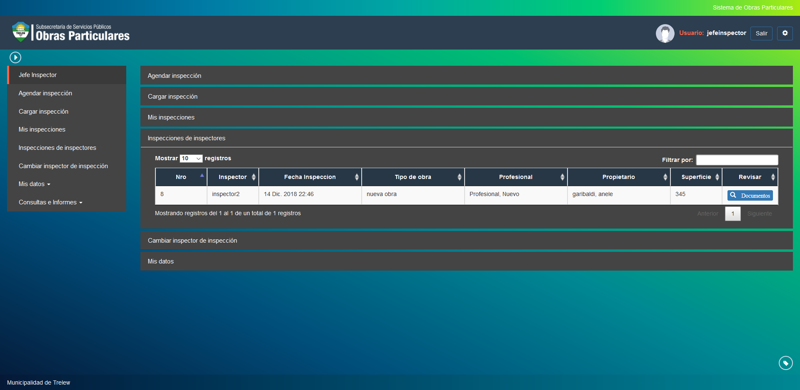

Inspecciones de inspectores
===========================

Esta opcion permite visualizar las inspecciones realizadas por los inspectores dentro del sistema.

- **Nro**: Indica el numero del tramite a agendar.
- **Inspector**: Indica el inspector a cargo del tramite.
- **Fecha Inspeccion**: Se debe ingresar la fecha en la que el inspector realizara la inspeccion del tramite.
- **Tipo de Obra**: Indica el tipo de obra del tramite.
- **Profesional**: Indica el profesional a cargo del tramite.
- **Propietario**: Indica el propietario del tramite.
- **Superficie**: Indica la superficie ocupada por la obra en curso.

Puede revisar la documentacion del tramite seleccionado haciendo click en el boton documentos.

