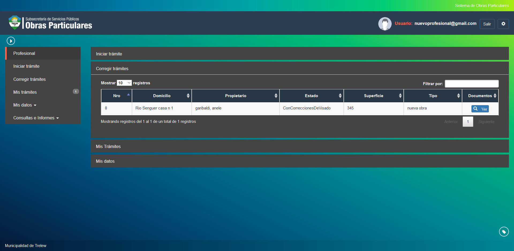
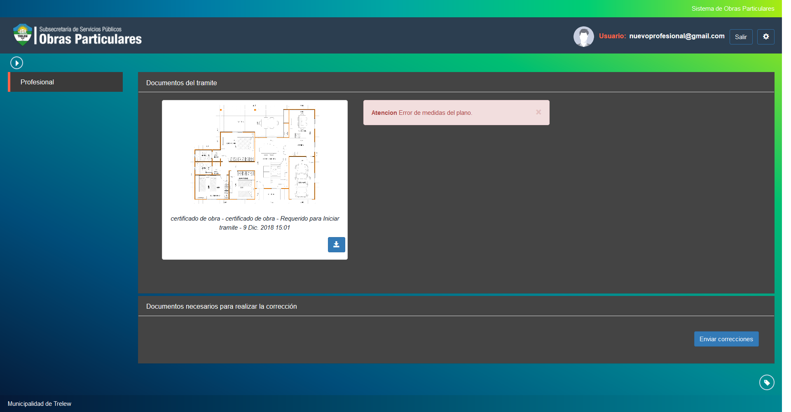

Corregir tramite
================

Esta opcion permite realizar la correccion de tramites que hayan sido devueltos por error en los documentos ingresados. Las opciones de visualizacion son las siguientes:

- **Nro**: Indica el numero del tramite a agendar.
- **Domicilio**: Indica el domicilio ocupado por la nueva obra.
- **Propietario**: Indica el propietario del tramite.
- **Estado**: Indica el estado actual del tramite. Es importante visualizar en el estado desde donde provienen las correcciones siendo posibles los siguientes origenes:
   * ConCorreccionesDeVisado
   * ConCorreccionesDeInspeccion
   * ConCorreccionesDeInspeccionFinal
   * ConCorreccionesDePrimerInspeccion
   * ConCorreccionesRealizadas
- **Superficie**: Indica la superficie ocupada por la obra en curso.
- **Tipo**: Indica el tipo del tramite.

Para visualizar las correcciones pendientes del tramite debera hacer click en la opcion Ver y se mostrara una pantalla indicando las correcciones enviadas y una indicacion del error encontrado.
Una vez corregidos los errores debera adjuntar la nueva documentacion y hacer click en el boton Enviar Correcciones.

