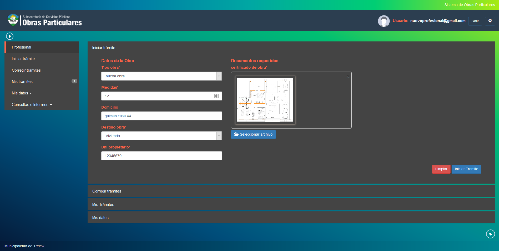

Iniciar tramite
===============

Esta opcion permite dar de alta un nuevo tramite dentro del sistema. Para ello debera indicar los siguientes datos indicados en el formulario:

- **Tipo de Obra**: Indica el tipo de obra que el profesional puede hacer.
- **Medidas**: Indica las medidas de superficie ocupadas por la obra en curso.
- **Domicilio**: Indica el domicilio donde se situa la nueva obra en curso.
- **Destino de obra**: Indica cual sera el destino de la nueva obra en curso.
- **Dni Propietario**: Indica el documento del propietario de la nueva obra en curso.
- **Documentos Requeridos**: Indica una lista de documentos requeridos para el inicio de un nuevo tramite de obra en el sistema. Esta lista esta indicada por la normativa y disposicion municipal vigente al momento de la creacion.

Una vez completados los campos requeridos puede dar inicio a un nuevo tramite haciendo click en el boton Iniciar Tramite. En caso de querer modificar todos los datos ingresados puede hacer click en el boton Limpiar.

El sistema validara el ingreso de los datos y ademas la existencia previa del propietario de obra ingresado. En caso de **no** estar registrado el mismo en el sistema, se solicitara ademas completar el formulario de ingreso de un nuevo propietario indicando los siguientes datos:

- **Dni**: Es el documento del usuario.
- **Nombre**: Es el nombre del usuario.
- **Apellido**: Es el apellido del usuario.
- **Telefono**: Es el telefono del usuario.
- **Domicilio**: Es el domicilio del usuario.
- **Cuil**: Es el cuil del usuario.
- **Mail**: Es el mail del usuario.

.. image:: ../_static/profesional.1_b.png

Cuando el formulario de carga haya sido completado debera ingresar nuevamente la opcion Inicar Tramite.
