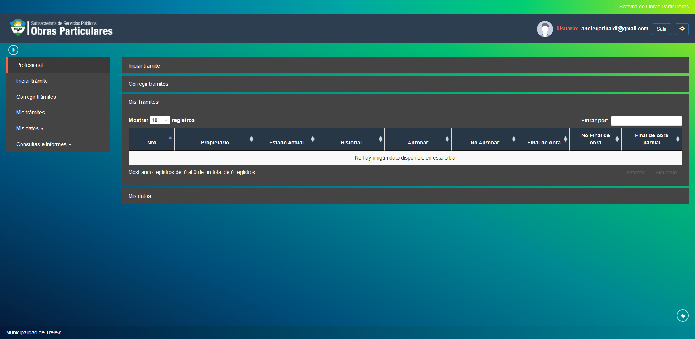
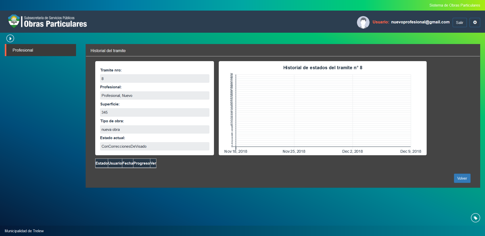
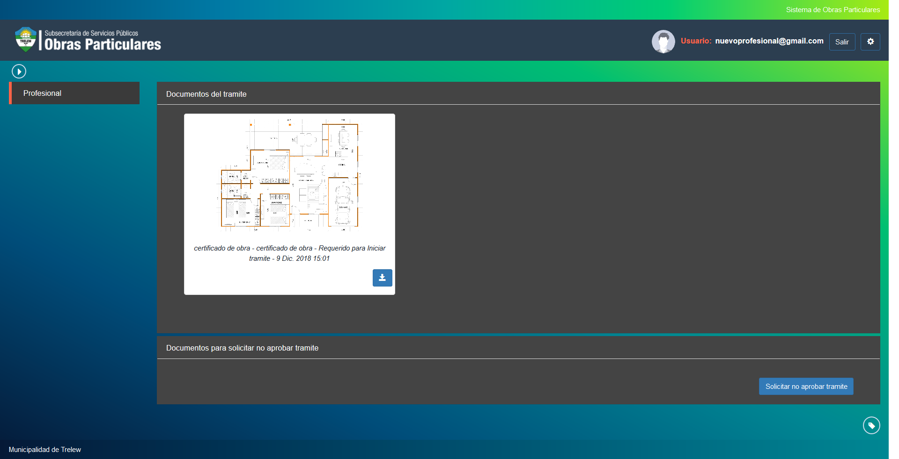

Mis tramites
============

Esta opcion permite realizar diferentes opciones relacionadas a los tramites que posee un profesional. Las opciones de visualizacion son las siguientes:

- **Nro**: Indica el numero del tramite a agendar.
- **Propietario**: Indica el propietario del tramite.
- **Estado Actual**: Indica el estado actual del tramite.

Ademas es posible visualizar opciones para:

- **Historial**: Indica en forma grafica el historial de estados por los que ha pasado un tramite.

- **Aprobar**: Esta opcion permite solicitar al sistema la aprobacion del tramite seleccionado. Debera tener en cuenta FALTA REALIZAR CAPTURA porque no me dan las opciones 

- **No Aprobar**: Esta opcion permite seleccionar no aprobacion de un tramite seleccionado.

- **Final de Obra**: Esta opcion permite solicitar al sistema el final de obra del tramite seleccionado.

.. image:: ../_static/profesional.3_d.png

- **No Final de Obra**: Esta opcion permite solicitar al sistema el no final de obra del tramite seleccionado.

.. image:: ../_static/profesional.3_d.png

- **Final de Obra Parcial**: Esta opcion permite solicitar al sistema el final de obra parcial del tramite seleccionado.

