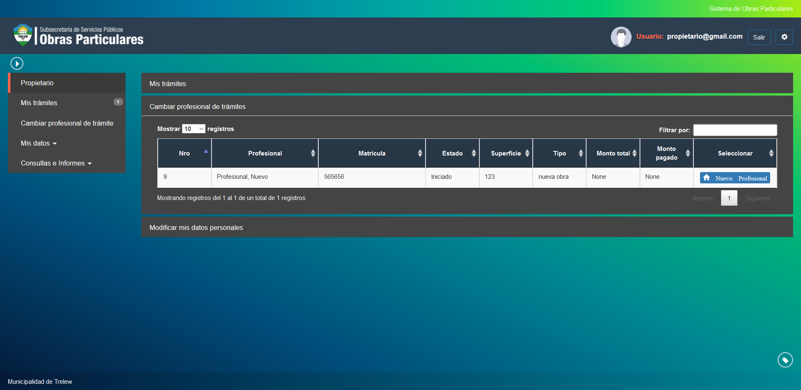
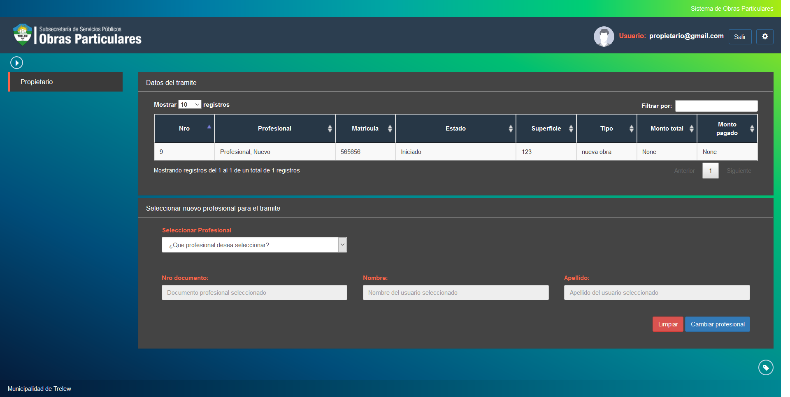

Cambiar profesional tramite
===========================

Esta opcion permite cambiar a un profesional de alguno de sus tramites en curso. Las opciones muestran datos del tramite y el profesional actual:

- **Numero**: Indica el numero de tramite actual.
- **Profesional**: Indica el profesional a cargo del tramite.
- **Matricula**: Indica el numero de matricula del profesional a cargo del tramite.
- **Estado**: Indica el estado actual en que se encuentra el tramite seleccionado.
- **Superficie**: Indica la superficie ocupada por la obra en curso.
- **Tipo**: Indica el tipo de obra que posee el tramite seleccionado.
- **Monto Total**: Indica el monto en pesos del tramite seleccionado.
- **Monto Pagado**: En caso de haber realizado el pago del tramite, esta opcion indica el monto en pesos registrado para el tramite seleccionado.

Para realizar el cambio del profesional actual asociado al tramite debera hacer click en la opcion Nuevo Profesional.

En esta pantalla debera completar el formulario de cambio de profesional indicando los siguientes campos:

- **Seleccionar Profesional**: Indica una lista de los profesionales actualmente registrados en el sistema para poder elegir.
- **Numero de Documento**: (Campo de solo lectura) Indica el numero del profesional seleccionado.
- **Nombre**: (Campo de solo lectura) Indica el nombre del profesional seleccionado.
- **Apellido**: (Campo de solo lectura) Indica el apellido del profesional seleccionado.

Una vez ingresado el profesional deseado debera hacer click en la opcion Cambiar Profesional para registrar el cambio. En caso de querer reestablecer los campos del formulario puede hacer click en la opcion Limpiar
