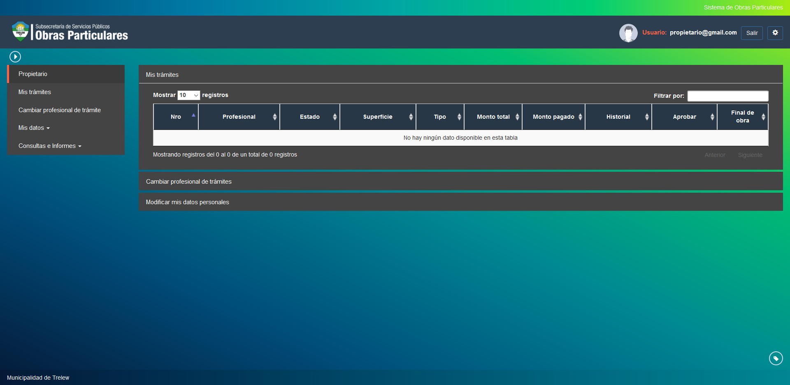
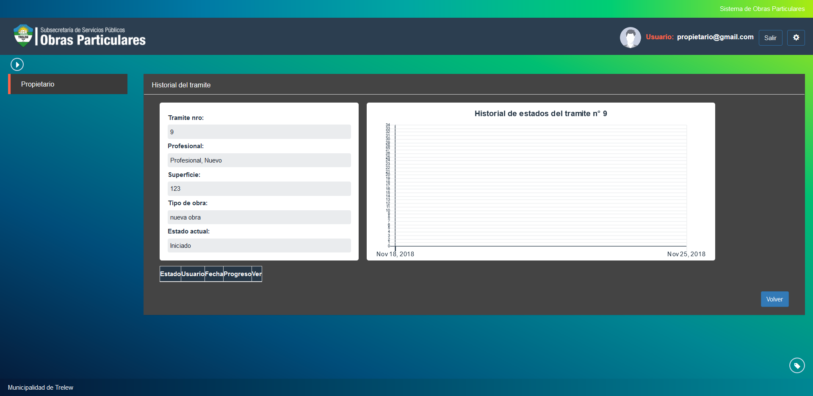
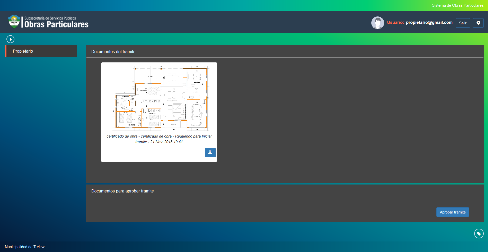

Mis tramites
============

Esta opcion permite visualizar datos de los tramites actuales del propietario. Las opciones visualizadas son las siguientes:

- **Nro**: Indica el numero del tramite a agendar.
- **Profesional**: Indica el profesional a cargo del tramite.
- **Estado**: Indica el estado actual del tramite.
- **Superficie**: Indica la superficie ocupada por la obra en curso.
- **Tipo**: Indica el tipo del tramite.
- **Monto Total**: Indica el monto en pesos del tramite seleccionado.
- **Monto Pagado**: En caso de haber realizado el pago del tramite, esta opcion indica el monto en pesos registrado para el tramite seleccionado.

Ademas es posible visualizar opciones para:

- **Historial**: Indica en forma grafica el historial de estados por los que ha pasado un tramite.

- **Aprobar**: Esta opcion permite solicitar al sistema la aprobacion del tramite seleccionado. Debera tener en cuenta

- **Fin de Obra**: Esta opcion permite solicitar al sistema el final de obra del tramite seleccionado.

