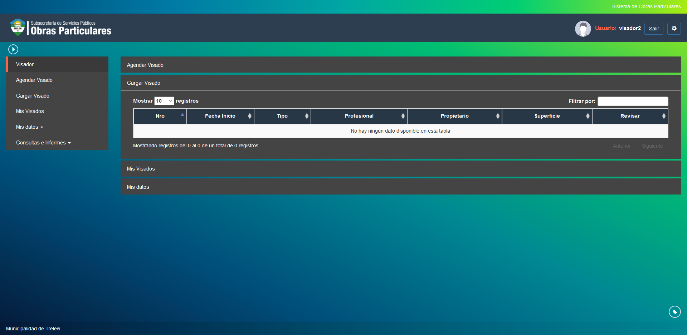
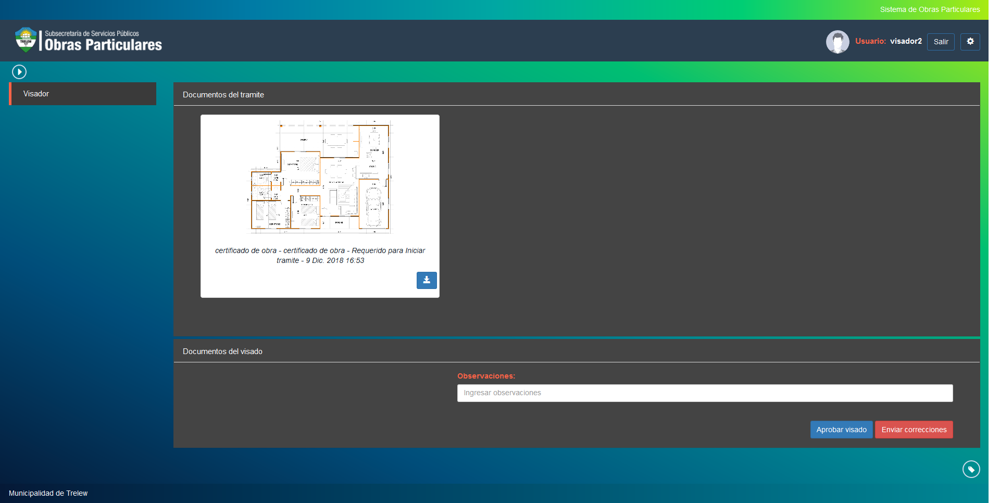

Cargar visado
=============

Esta opcion permite cargar la planilla de visado de un tramite dentro del sistema indicando si se cumplen o no las condiciones de aprobacion. Las opciones a visualizar son las siguientes:

- **Nro**: Indica el numero del tramite a agendar.
- **Fecha Inicio**: Indica la fecha de inicio del tramite a agendar.
- **Tipo**: Indica el tipo del tramite.
- **Profesional**: Indica el profesional a cargo del tramite.
- **Propietario**: Indica el propietario del tramite.
- **Superficie**: Indica la superficie ocupada por la obra en curso.

Puede revisar la documentacion del tramite seleccionado haciendo click en el boton documentos.

Para la aprobacion o rechazo del tramite debe hacer click en el boton aprobar visado o enviar correcciones, adjuntando la planilla de visado correspondiente.

