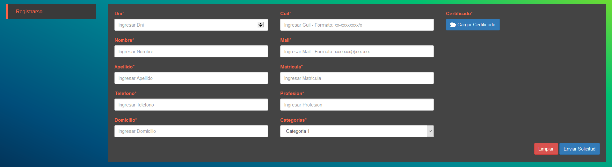

***********************
Manual Inicio de Sesion
***********************

Bienvenido al manual de ayuda al ingreso al sistema. En esta pantalla encontrara dos funcionaliades principales:

Ingreso al sistema
------------------

Para ingresar al sistema debera proporcionar los siguientes datos en los campos:

- **Nombre de usuario**: El nombre de usuario que se le haya sido otorgado.
- **Contraseña**: La contraseña que haya seleccionado.

una vez ingresados los datos debera hacer click en la opcion Ingresar

Creacion de un nuevo profesional
--------------------------------

Para solicitar el alta de un nuevo profesional en el registro de profesionales del sistema debera completar el formulario de alta de profesionales indicando los siguientes campos:

- **Dni**: Es el documento del usuario.
- **Nombre**: Es el nombre del usuario.
- **Apellido**: Es el apellido del usuario.
- **Telefono**: Es el telefono del usuario.
- **Domicilio**: Es el domicilio del usuario.
- **Cuil**: Es el cuil del usuario.
- **Mail**: Es el mail del usuario.

- **Matricula**: Es el numero de matricula habilitante del profesional.

- **Profesion**: Indica la profesion actual del profesional ingresado.
- **Categoria**: Indica la categoria que posee el profesional siendo posibles las siguientes opciones:
   * Categoria 1:
   * Categoria 2:
   * Categoria 3:
- **Certificado**: Campo disponible para la carga de una copia del certificado habilitante como ....

Una vez completado el formulario en su totalidad podra solicitar el alta de un nuevo profesional ingresando la opcion Enviar Solicitud, en caso de querer reestablecer los datos del formulario puede ingresar la opcion Limpiar
